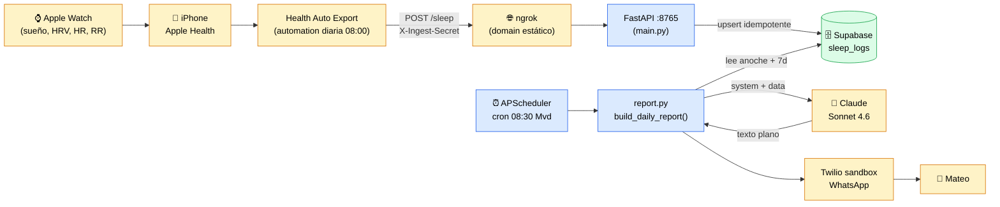
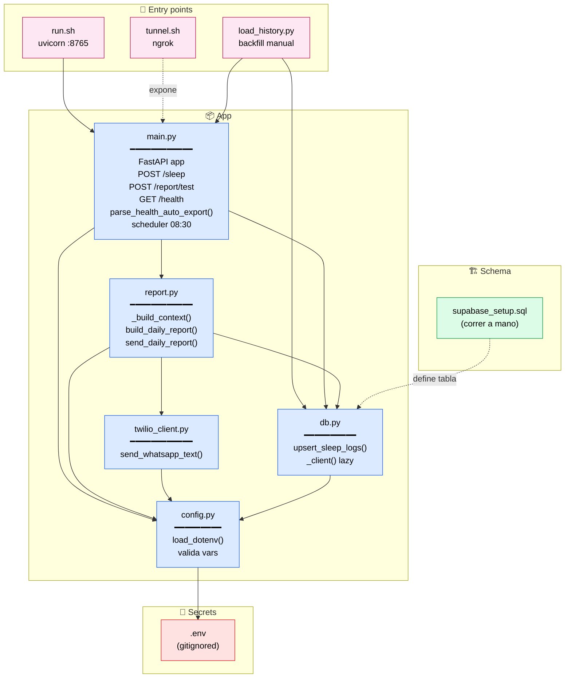
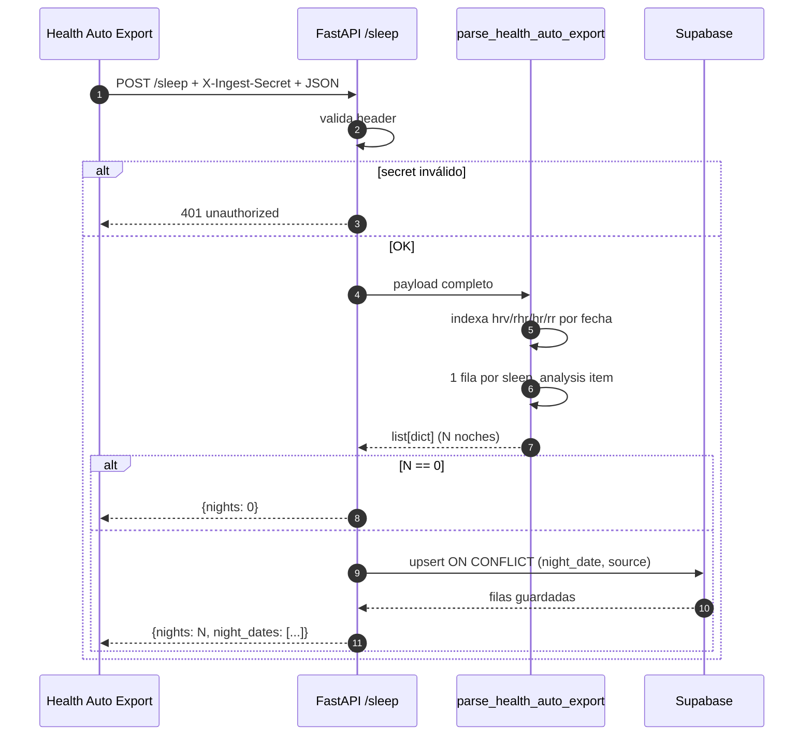
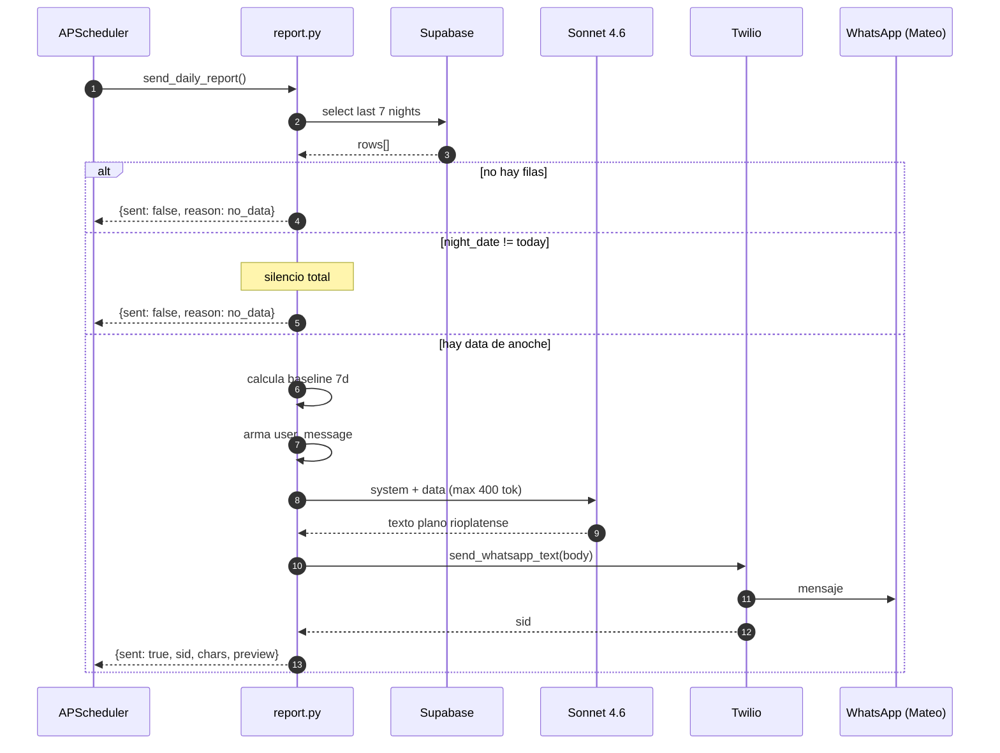
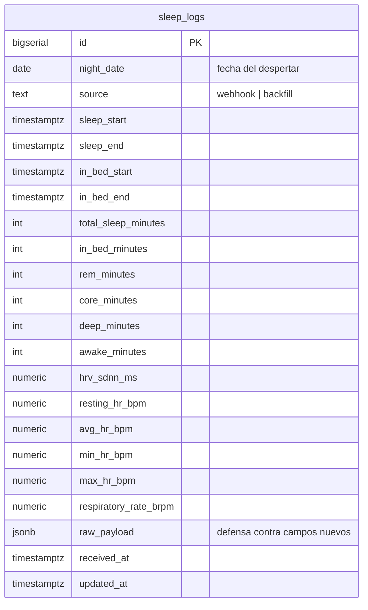
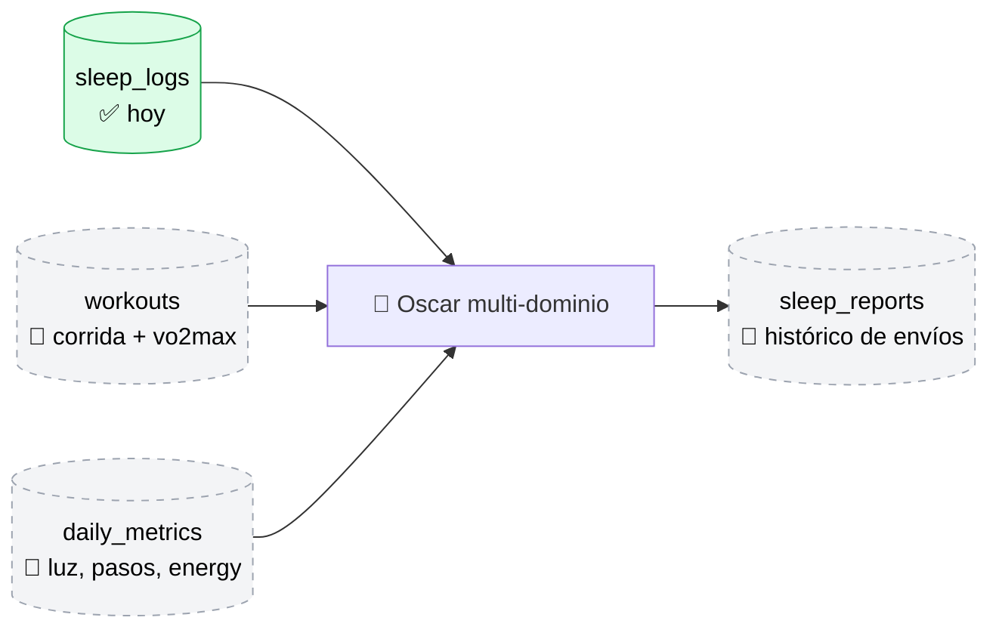

# Arquitectura de SleepAgent (Oscar)

Diagramas en Mermaid. En VS Code abrir con el preview de Markdown + extensión
de Mermaid; en GitHub se renderizan solos.

---

## 1. Vista de pájaro — qué le pasa a una noche

**Tres colores:**
- 🟡 Amarillo: cosas externas (Apple, ngrok, Claude, Twilio, vos).
- 🔵 Azul: código que corre en tu Mac.
- 🟢 Verde: el store.

---

## 2. Mapa de archivos y dependencias

---

## 3. Ingesta — qué pasa cuando llega un `POST /sleep`

---

## 4. Reporte diario — qué pasa a las 08:30

---

## 5. Modelo de datos (hoy — F1.5)

**Reglas:**
- `UNIQUE(night_date, source)` → upsert idempotente.
- RLS ON sin policies → solo el backend con `service_role` puede tocarla.
- Trigger `BEFORE UPDATE` mantiene `updated_at` fresco.

---

## 6. Hacia dónde va (F2)

